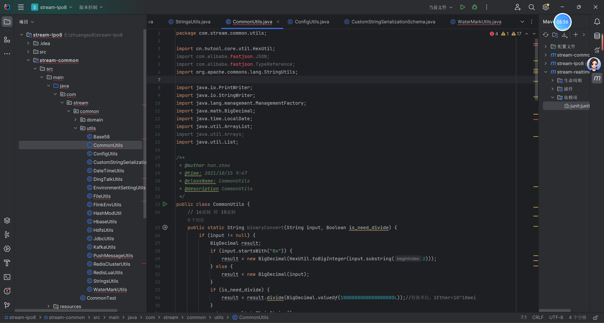
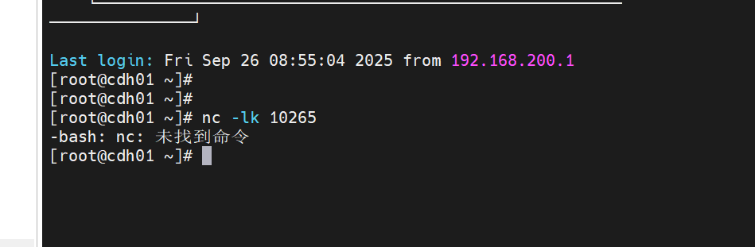
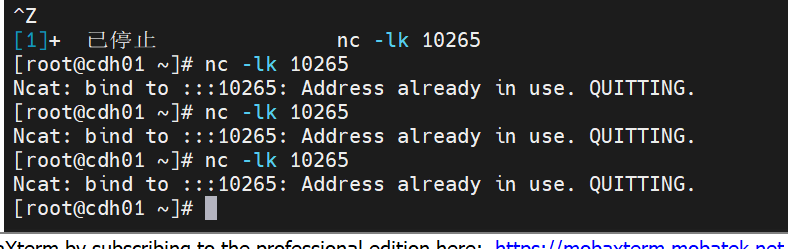

### Eric 0926 Report
1.复制过来依赖 报错

查询ai得知 依赖jar包 没有进来 重新创建项目 重复以上操作成功解决
2.在两者对话中 执行命令失败 得知没有安装nc命令 和netcat 未安装

执行 yum install -y netcat-openbsd 与 安装nc yum install -y nc 成功解决问题
3.发现重复执行 报错

得知 后台一直在运行 要输入命令删除后台任务
输入kill -192356端口号 
删不掉 加-9 强制删除后台任务
4.看视频 做项目